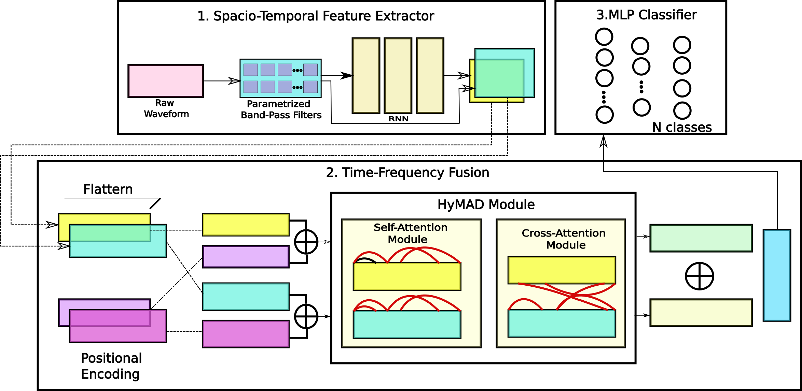

# HyMAD — Hybrid Multi-Activity Detection

> **Multi-label seismic activity classification from raw waveforms under full spectral overlap**

[](https://www.python.org/)
[](https://pytorch.org/)
[](LICENSE)

---

## Overview

Detecting concurrent seismic activities (e.g., a human intruder alongside a moving vehicle) is substantially harder than single-event classification because both activities share the same frequency band — standard spectral decomposition cannot separate them. HyMAD addresses this by fusing a learnable frequency encoder (SincNet) with an LSTM temporal encoder through a **bidirectional cross-attention** mechanism, enabling joint spectral–temporal reasoning over spectrally overlapping signals.

**Key result:** HyMAD achieves **96.5% F1 / 94.0% exact match** on a full-spectral-overlap benchmark, outperforming the strongest raw-waveform baseline (CNN-1D) by **28.0%** on concurrent-activity samples where both activities must be jointly detected.

---

## Architecture



The pipeline has three stages:

1. **Spatio-Temporal Feature Extractor** — SincNet (40 bandpass filters, kernel=251, mel-scale initialized in [20–500] Hz) extracts interpretable spectral features from the raw waveform, which are downsampled to 64 time steps and fed into a 3-layer LSTM to capture temporal dynamics.
2. **Time-Frequency Fusion (HyMAD Module)** — Both the SincNet and LSTM outputs receive positional encodings and pass through their own self-attention blocks. A bidirectional cross-attention module then lets the frequency stream attend to the temporal stream and vice versa, with the two outputs mean-pooled and concatenated into a 256-dim representation.
3. **MLP Classifier** — A two-layer MLP (256 → 128 → 4) with sigmoid activation produces independent probability scores for each activity class.

224K parameters total.

---

## Results

### Main comparison (exact match accuracy)

| Model | Feature | Exact Match | F1 | AUROC |
|---|---|---|---|---|
| Random Forest | MFCC | 78.4% | 90.4% | 97.1% |
| LightGBM | MFCC | 79.4% | 91.0% | 97.8% |
| MLP | MFCC | 84.5% | 91.5% | 98.0% |
| Transformer | MFCC | 87.5% | 92.7% | 98.5% |
| BiLSTM | MFCC | 91.8% | 94.8% | 99.2% |
| LSTM | MFCC | 90.5% | 94.4% | 99.1% |
| CNN-1D | Raw | 82.2% | 92.4% | 98.3% |
| **HyMAD (ours)** | **Raw** | **94.0%** | **96.5%** | **99.5%** |

### Single-label vs. concurrent-activity breakdown

| Model | Single-activity | Concurrent-activity |
|---|---|---|
| CNN-1D (Raw) | 99.2% | 57.8% |
| **HyMAD (ours)** | **99.7%** | **85.7%** |

The 28-point gap on concurrent-activity samples demonstrates that cross-attention fusion is essential for jointly disentangling spectrally overlapping signals.

---

## Dataset

The dataset contains seismic recordings from a geophone array (HSG HG-24U, 10 Hz natural frequency) digitized at 8 kHz via a 24-bit DAQ. Each sample is a ~1-second segment (7999 samples).

**Single-activity classes:**

| Class | Count |
|---|---|
| Animal Movement | 3,350 |
| Human Movement | 4,020 |
| No Event | 4,020 |
| Vehicle Movement | 3,960 |

**Multi-activity classes (linearly superimposed, no bandpass pre-filtering):**

| Class | Count |
|---|---|
| Animal + Human | 3,350 |
| Human + Vehicle | 3,960 |
| Animal + Vehicle | 3,350 |

**Total: 26,010 samples.** Train / val / test split is 70 / 15 / 15.

> The dataset is not included in this repository. Place it at `../seismic/Superimposed_Data/` with `train/`, `val/`, and `test/` subdirectories. Each `.pt` file should contain `{"signal": Tensor[7999], "label": Tensor[4]}`.

---

## Setup

```bash
conda create -n torch_env python=3.10
conda activate torch_env
pip install torch==2.4.0 torchvision torchaudio
pip install scikit-learn scipy matplotlib tensorboardX tqdm
```

---

## Training

```bash
python train.py                   # saves to runs/HyMAD/
python train.py --exp my_run      # custom experiment name
```

The best checkpoint (lowest validation loss) is saved as `runs/<exp>/best_model.pth`. Training uses AdamW (lr=5×10⁻³, weight decay=10⁻⁴), batch size 256, 400 epochs with 15% linear warmup followed by cosine decay.

---

## Evaluation

```bash
python inference.py               # evaluates runs/HyMAD/best_model.pth
python inference.py --exp my_run  # custom experiment
```

Outputs: per-class classification report, confusion matrices, ROC curves, and precision–recall curves saved under `runs/<exp>/`.

---

## Ablations

```bash
python ablations/run_ablations.py
```

Runs ablation variants: full HyMAD, no RNN, no self-attention, unidirectional cross-attention, naive fusion (concatenation), and Conv1D front-end (SincNet replaced with standard Conv1d).

Results are saved to `ablations/results/summary.json`.

---

## Analysis Scripts

| Script | Description |
|---|---|
| `data_realism.py` | Generates the superimposed multi-activity dataset from single-activity recordings |
| `scripts/generate_dataset_figures.py` | Waveform, energy, PSD, and spectrogram figures |
| `scripts/plot_discriminative_freq.py` | Per-class PSD + Fisher discriminability analysis of seismic signal frequency characteristics |
| `scripts/tsne.py` | t-SNE of penultimate-layer embeddings |

```bash
python scripts/generate_dataset_figures.py
python scripts/plot_discriminative_freq.py
python scripts/tsne.py
```

---

## Repository Structure

```
HyMAD/
├── data_realism.py            # Dataset generation: superimposes single-activity recordings
├── model/
│   ├── model.py               # SincNetRNN (full HyMAD)
│   ├── sincnet.py             # SincConv1D with data-driven initialization
│   ├── transformer.py         # SelfAttention, CrossAttention
│   └── positional_encoding.py
├── dataset/
│   └── multi_label.py         # SeismicMergedDataset
├── baseline/
│   ├── baseline.py            # All baselines (RF, LightGBM, CNN-1D, etc.)
│   └── extract_feats.py       # MFCC / LogMel / LFSCC feature extraction
├── ablations/
│   ├── models.py              # Ablation model variants
│   └── run_ablations.py       # Ablation training loop
├── scripts/
│   ├── generate_dataset_figures.py
│   ├── plot_discriminative_freq.py
│   └── tsne.py
├── train.py                   # Main training script
└── inference.py               # Evaluation + visualisation
```

---

## Citation

If you use this work, please cite:

```bibtex
@misc{srinivasan2025hymadhybridmultiactivitydetection,
  title         = {HyMAD: A Hybrid Multi-Activity Detection Approach for Border Surveillance and Monitoring},
  author        = {Sriram Srinivasan and Srinivasan Aruchamy and Siva Ram Krisha Vadali},
  year          = {2025},
  eprint        = {2511.14698},
  archivePrefix = {arXiv},
  primaryClass  = {cs.CV},
  url           = {https://arxiv.org/abs/2511.14698},
}
```

---

## License

MIT
